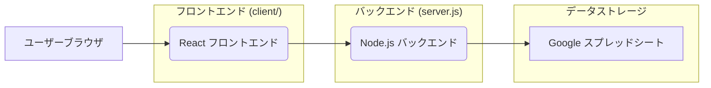
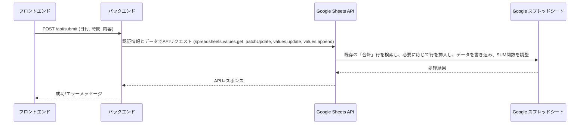
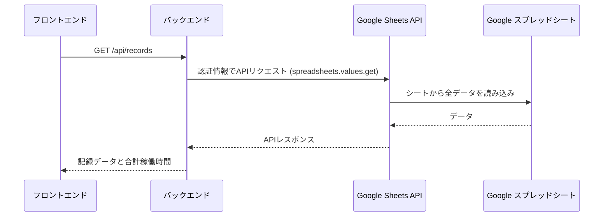
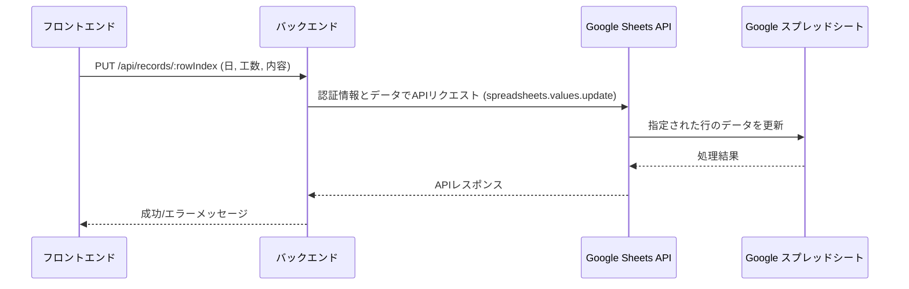
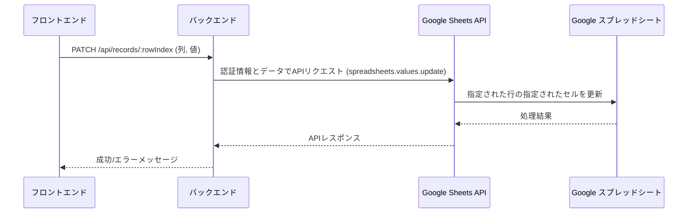
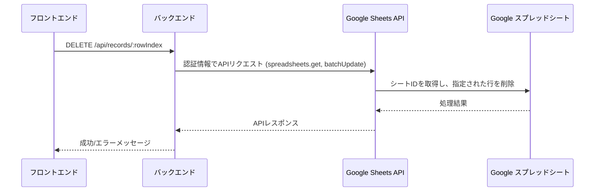

# サービス構成詳細

このサービスは、Node.js (Express) をバックエンド、React をフロントエンドとするフルスタックアプリケーションです。データストレージとして Google スプレッドシートを利用し、Google API を介してデータの読み書きを行います。

## 1. 全体アーキテクチャ

## 2. 各コンポーネントの詳細

### 2.1. フロントエンド (client/)

*   **技術スタック:**
    *   **React:** UI構築のためのJavaScriptライブラリ。
    *   **Bootstrap 5:** レスポンシブなデザインとUIコンポーネントを提供。CDN経由で読み込まれています。
    *   **Font Awesome 6:** アイコン表示に使用。CDN経由で読み込まれています。
*   **主な機能:**
    *   日付、稼働時間、内容の入力フォーム。
    *   記録されたデータの表示（カード形式のリスト）。
    *   合計稼働時間とそれに基づく合計金額の表示。
    *   記録の編集、更新、削除機能（モーダルウィンドウ経由）。
    *   APIからのデータ取得と表示のローディング状態管理。
*   **APIとの連携:**
    *   バックエンドのAPIエンドポイント (`/api/submit`, `/api/records` など) に対して `fetch` API を使用してHTTPリクエストを送信します。
    *   開発時には `client/package.json` の `proxy` 設定 (`"proxy": "http://localhost:3001"`) により、APIリクエストはバックエンドサーバーに転送されます。

### 2.2. バックエンド (server.js)

*   **技術スタック:**
    *   **Node.js:** サーバーサイドの実行環境。
    *   **Express.js 5:** Webアプリケーションフレームワーク。APIエンドポイントのルーティングとリクエスト/レスポンス処理を担当します。
    *   **googleapis:** Google APIと連携するための公式Node.jsクライアントライブラリ。
    *   **google-auth-library:** Google API認証のためのライブラリ。
    *   **dotenv:** 環境変数 (`.env`ファイル) の読み込みに使用されます。
*   **主な機能:**
    *   **APIエンドポイントの提供:**
        *   `POST /api/submit`: 新しい稼働記録をスプレッドシートに保存します。
        *   `GET /api/records`: スプレッドシートからすべての稼働記録と合計稼働時間を取得します。
        *   `PUT /api/records/:rowIndex`: 指定された行の稼働記録を更新します。
        *   `PATCH /api/records/:rowIndex`: 指定された行の特定のセル（日、時間、内容）を更新します。
        *   `DELETE /api/records/:rowIndex`: 指定された行の稼働記録を削除します。
    *   **Google スプレッドシートとの連携:**
        *   `SPREADSHEET_ID` と `SHEET_NAME` を使用して、特定のGoogleスプレッドシートの特定のシートにアクセスします。
        *   データの読み書き、行の挿入/削除、セルの更新、SUM関数の調整などを行います。
    *   **静的ファイルの配信:**
        *   `client/build` ディレクトリにビルドされたReactアプリケーションの静的ファイル（HTML, CSS, JavaScriptなど）を配信します。
        *   SPA (Single Page Application) のためのフォールバックルーティング (`app.get('*', ...)`) を設定し、APIルート以外のすべてのGETリクエストに対して `index.html` を返します。
*   **認証:**
    *   Google APIへの認証には、サービスアカウントの認証情報を使用します。
    *   認証情報は、プロジェクトルートの `credentials.json` ファイルから読み込むか、または環境変数 (`GOOGLE_CLIENT_EMAIL`, `GOOGLE_PRIVATE_KEY`) から読み込むように設定されています。環境変数が優先されます。

### 2.3. データストレージ (Google スプレッドシート)

*   **役割:** アプリケーションのすべての稼働記録を保存するデータベースとして機能します。
*   **構成:** 特定のGoogleスプレッドシート内の指定されたシート (`SHEET_NAME`) が使用されます。
*   **データ構造:** 各行が1つの稼働記録を表し、日付、稼働時間、内容などの列が含まれます。特定の行（例: 「合計」行）は集計情報のために使用されます。

## 3. 使用されている主要なAPI

### 3.1. Google Sheets API (v4)

*   **用途:** Google スプレッドシートのデータをプログラムで操作するために使用されます。
*   **主な操作:**
    *   `spreadsheets.values.get`: シートからデータを読み取ります。
    *   `spreadsheets.values.append`: シートの末尾に新しいデータを追加します。
    *   `spreadsheets.values.update`: シートの既存のデータを更新します。
    *   `spreadsheets.batchUpdate`: 行の挿入や削除など、複数の操作をバッチで実行します。
    *   `spreadsheets.get`: スプレッドシートのメタデータ（シートIDなど）を取得します。

### 3.2. Google Drive API

*   **用途:** Google Sheets APIの認証スコープの一部として含まれていますが、直接的なファイル操作には使用されていません。Google Sheets APIがGoogle Driveの権限を必要とするため、認証スコープに含まれています。

## 4. 開発環境とデプロイ

*   **開発環境:**
    *   バックエンド: `npm start` (プロジェクトルート)
    *   フロントエンド: `npm start` (`client/` ディレクトリ内)
*   **デプロイ:**
    *   Render などのPaaS (Platform as a Service) にデプロイすることを想定しています。
    *   本番環境では、`client/build` ディレクトリにビルドされた静的ファイルがバックエンドサーバーによって配信されます。
    *   Google APIの認証情報は、環境変数またはSecret Fileとしてデプロイ環境に安全に設定する必要があります。

## 5. APIシーケンス図

### 5.1. 記録の送信 (POST /api/submit)

新しい稼働記録をスプレッドシートに保存する際のシーケンスです。

### 5.2. 記録の取得 (GET /api/records)

スプレッドシートからすべての稼働記録と合計稼働時間を取得する際のシーケンスです。

### 5.3. 記録の更新 (PUT /api/records/:rowIndex)

指定された行の稼働記録を更新する際のシーケンスです。

### 5.4. セルの部分更新 (PATCH /api/records/:rowIndex)

指定された行の特定のセル（日、時間、内容）を部分的に更新する際のシーケンスです。

### 5.5. 記録の削除 (DELETE /api/records/:rowIndex)

指定された行の稼働記録を削除する際のシーケンスです。

